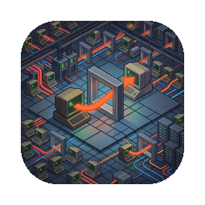

<p align="center">
  
</p>

# Tunnel Master

A lightweight SSH tunnel manager that lives in your menu bar. Create, manage, and monitor SSH port-forwarding tunnels without touching the terminal.

Built with SwiftUI and Rust (via [UniFFI](https://mozilla.github.io/uniffi-rs/)). macOS 14+ (Sonoma).

## Features

- **Menu bar app** — runs in the background, click the tray icon to open
- **One-click connect/disconnect** — start and stop tunnels instantly
- **Real-time traffic monitor** — per-tunnel sparkline charts
- **In-app config editor** — add, edit, delete, and reorder tunnels
- **Multiple auth methods** — SSH key, password, agent, keyboard-interactive (2FA)
- **ProxyJump support** — connect through jump hosts
- **Keychain integration** — stores SSH passphrases and passwords securely
- **Native file picker** — browse for SSH key files
- **Auto-reconnect ready** — health monitoring with keepalive detection

## Install

### macOS (current — v1.0+)

Download the latest `.dmg` from [Releases](../../releases).

> **Note:** The app is not code-signed. macOS will show a warning. To fix:
> ```bash
> xattr -cr /Applications/Tunnel\ Master.app
> ```

### Linux / Windows

The SwiftUI version is macOS-only. For Linux and Windows, use the last Tauri release:
[**v0.5.3**](../../releases/tag/v0.5.3) (Tauri + React, cross-platform).

## Development

### Prerequisites

- [Rust](https://rustup.rs/) (stable)
- Xcode 16+ (for SwiftUI build)
- [XcodeGen](https://github.com/yonaskolb/XcodeGen) (`brew install xcodegen`)

### Build

```bash
cd macos-app
./build.sh
```

This builds the Rust core, generates UniFFI Swift bindings, and creates the Xcode project.

### Run

Open `macos-app/TunnelMaster.xcodeproj` in Xcode and run, or:

```bash
cd macos-app
xcodebuild -project TunnelMaster.xcodeproj -scheme TunnelMaster -configuration Debug build
```

### Test

```bash
cd rust-core && cargo test
```

## Configuration

Tunnels are stored in `~/.tunnel-master/config.json`. You can edit this file directly or use the in-app editor (click the pencil icon).

```json
{
  "version": 1,
  "tunnels": [
    {
      "id": "my-database",
      "name": "My Database",
      "host": "bastion.example.com",
      "port": 22,
      "user": "sergio",
      "authMethod": "key",
      "keyPath": "~/.ssh/id_ed25519",
      "type": "local",
      "localPort": 5432,
      "remoteHost": "db.internal",
      "remotePort": 5432,
      "autoConnect": false,
      "jumpHost": null,
      "showTrafficChart": true
    }
  ],
  "settings": {
    "keepaliveIntervalSecs": 15,
    "keepaliveTimeoutSecs": 30,
    "connectionTimeoutSecs": 10,
    "launchAtLogin": false
  }
}
```

## Architecture

```
rust-core/src/
├── api.rs              # TunnelCore — UniFFI entry point for Swift
├── events.rs           # TunnelEventHandler callback trait
├── config/store.rs     # Config file load/save with atomic writes
├── tunnel/
│   ├── manager.rs      # Actor-based tunnel lifecycle management
│   ├── connection.rs   # SSH connection via russh
│   ├── forwarder.rs    # TCP port forwarding with byte counting
│   ├── traffic.rs      # Traffic counters and sparkline data
│   └── health.rs       # Keepalive health monitoring
├── keychain.rs         # Credential storage (macOS Keychain)
├── errors.rs           # Error types
└── types.rs            # Shared data types (UniFFI-annotated)

macos-app/TunnelMaster/
├── TunnelMasterApp.swift    # @main, MenuBarExtra with .window style
├── TunnelViewModel.swift    # @Observable, implements TunnelEventHandler
├── ContentView.swift        # View routing
├── Views/
│   ├── TunnelListView.swift
│   ├── TunnelRow.swift
│   ├── TrafficSparkline.swift
│   ├── EditListView.swift
│   └── EditFormView.swift
└── Dialogs/
    ├── PassphraseDialog.swift
    ├── PasswordDialog.swift
    ├── HostKeyDialog.swift
    └── KeyboardInteractiveDialog.swift
```

## License

MIT
